# Clínica Veterinaria - API REST con Docker

API REST para el registro de mascotas de una clínica veterinaria, desplegada con Docker, Nginx (proxy inverso), Node.js/Express y MySQL.

## Arquitectura

| Servicio | Imagen base          | Puerto interno | Puerto publicado | Función                          |
|----------|----------------------|----------------|------------------|----------------------------------|
| nginx    | nginx:1.27-alpine    | 80             | 8080             | Proxy inverso                    |
| api      | node:22-alpine (propia) | 3000        | No se publica    | API REST CRUD de mascotas        |
| db       | mysql:8.4            | 3306           | No se publica    | Base de datos con persistencia   |

Solo el puerto 8080 de Nginx está expuesto al host. La API y MySQL solo son accesibles dentro de la red interna de Docker.

## Estructura del proyecto

```
proyecto/
├── docker-compose.yml
├── api/
│   ├── Dockerfile
│   ├── .dockerignore
│   ├── package.json
│   └── index.js
├── nginx/
│   └── default.conf
├── db/
│   └── init.sql
├── .gitignore
└── README.md
```

## Requisitos

- Docker
- Docker Compose

## Construcción y ejecución

```bash
# Construir las imágenes
docker compose build

# Levantar el sistema en segundo plano
docker compose up -d

# Verificar que los tres contenedores están en ejecución
docker compose ps

# Ver logs de cada servicio
docker compose logs -f api
docker compose logs -f nginx
docker compose logs -f db
```

## Endpoints de la API

Todas las peticiones se hacen a través de Nginx en `http://localhost:8080`.

### 1. Listar todas las mascotas
```bash
curl http://localhost:8080/mascotas
```

### 2. Obtener una mascota por ID
```bash
curl http://localhost:8080/mascotas/1
```

### 3. Registrar una nueva mascota
```bash
curl -X POST http://localhost:8080/mascotas \
  -H "Content-Type: application/json" \
  -d '{"nombre":"Luna","especie":"Perro","edad":3,"peso":12.5}'
```

### 4. Actualizar una mascota
```bash
curl -X PUT http://localhost:8080/mascotas/1 \
  -H "Content-Type: application/json" \
  -d '{"nombre":"Michi","especie":"Gato","edad":4,"peso":4.2}'
```

### 5. Eliminar una mascota
```bash
curl -X DELETE http://localhost:8080/mascotas/1
```

## Verificar persistencia

1. Registra una mascota nueva con POST.
2. Detén y elimina los contenedores (sin borrar el volumen):
   ```bash
   docker compose down
   ```
3. Vuelve a levantar el sistema:
   ```bash
   docker compose up -d
   ```
4. Verifica con `GET /mascotas` que la mascota sigue existiendo.

## Limpieza completa

```bash
# Eliminar contenedores y volumen
docker compose down -v

# Listar imágenes
docker images

# Eliminar imágenes creadas (opcional)
docker rmi proyecto-api
```

## Variables de entorno (API)

| Variable      | Descripción              | Valor por defecto |
|---------------|--------------------------|-------------------|
| DB_HOST       | Host de MySQL            | db                |
| DB_USER       | Usuario de MySQL         | root              |
| DB_PASSWORD   | Contraseña de MySQL      | rootpassword      |
| DB_NAME       | Nombre de la base de datos | veterinaria     |


---

## Evidencias

### 1. Contenedores en ejecución (`docker compose ps`)

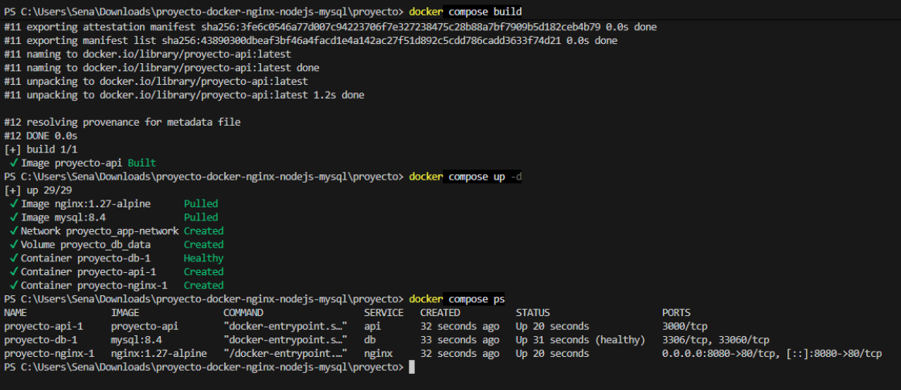

### 2. Endpoints de la API (profe me tome la libertad de añadirle comentarios a los comandos °v°)

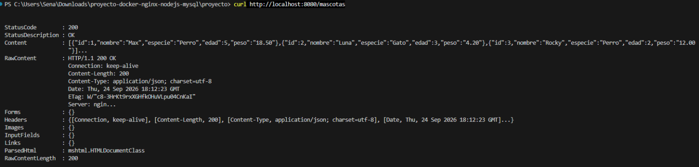
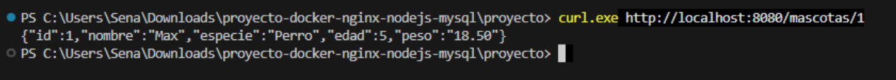
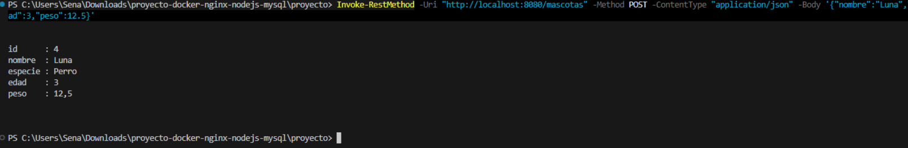
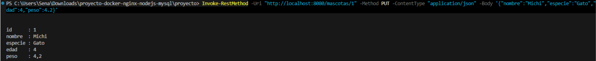
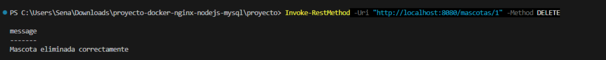
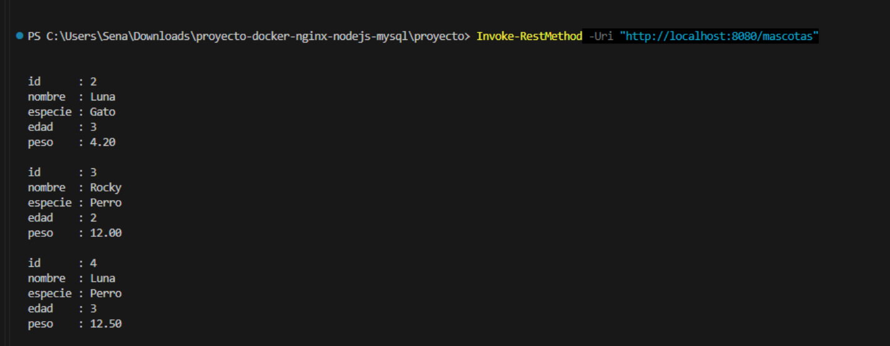
### 3. Persistencia de datos

#### Antes de `docker compose down` (mascota registrada)
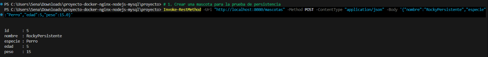
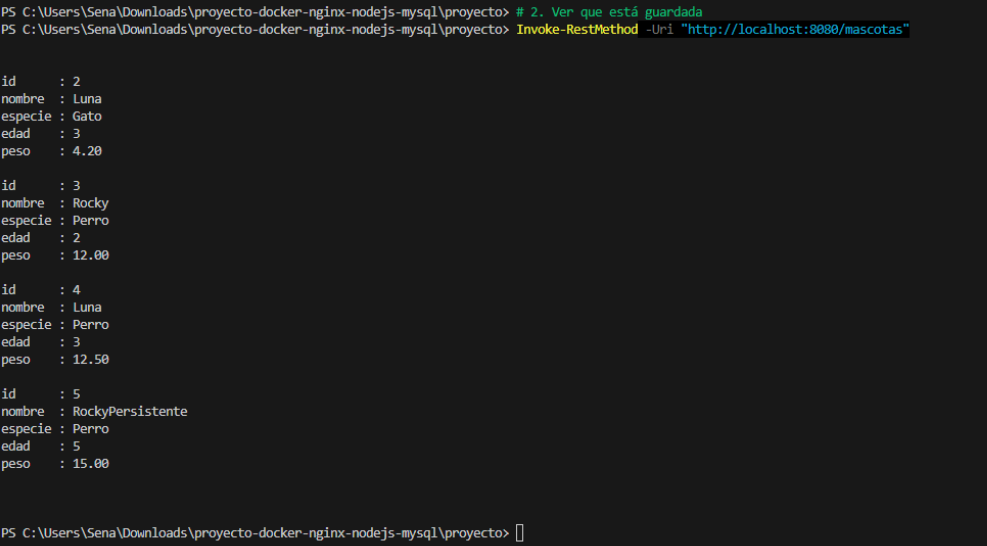
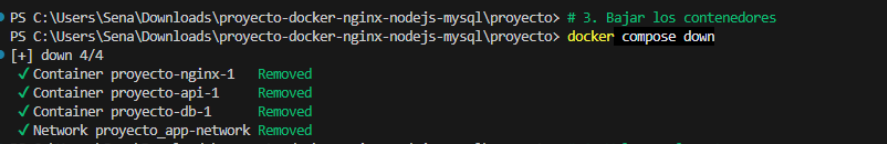
#### Después de `docker compose up -d` (mascota sigue existiendo)
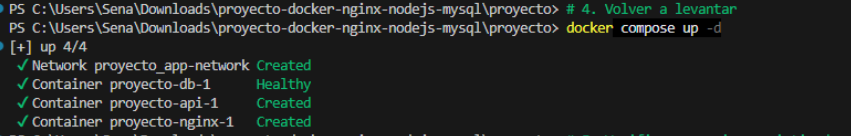
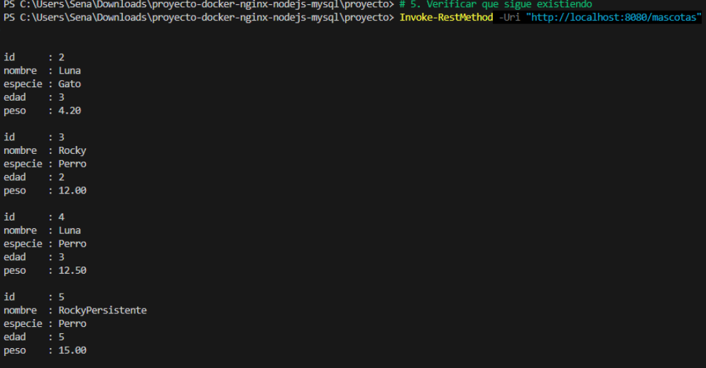